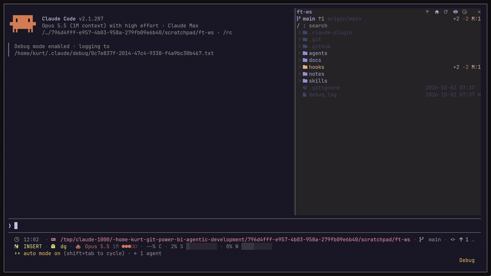
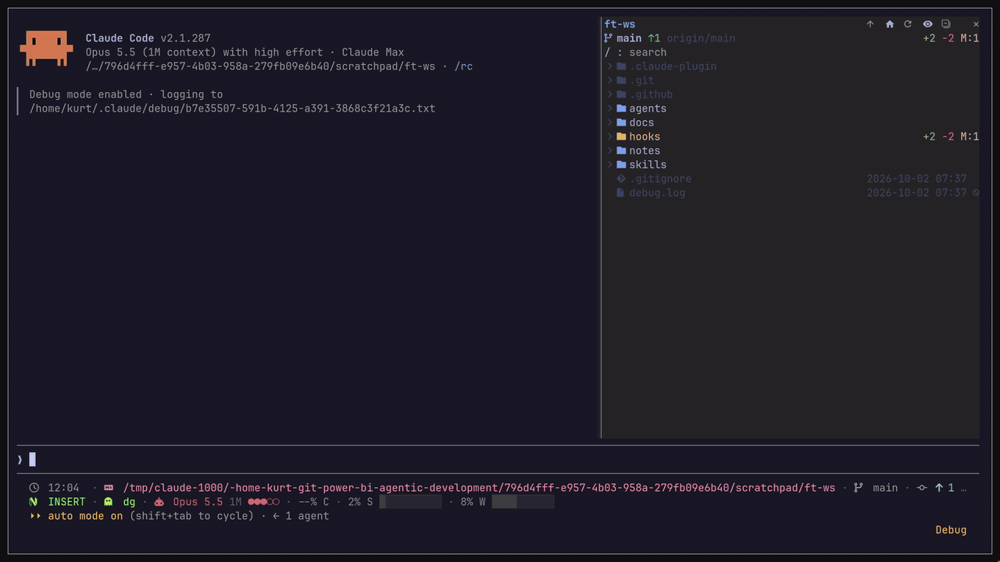
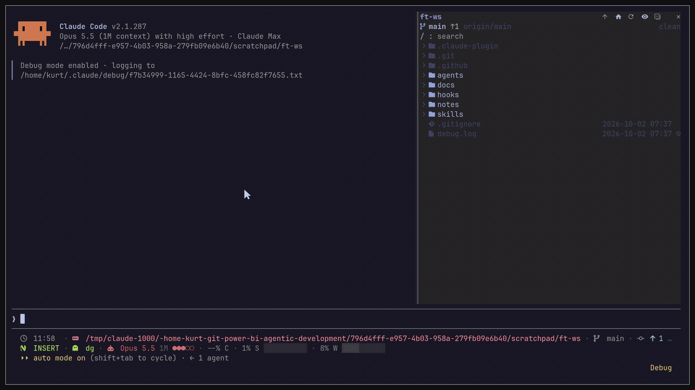

<h1 align="center">Claude Code Filetree</h1>

<p align="center">
  An IDE-style file tree for Claude Code that shows what Claude is doing and where in files
</p>

<p align="center">
  
  
  
  
</p>

<p align="center">
  
</p>

> [!NOTE]
> filetree is a Claude Code **mod**: a plugin of function hooks with its own pane. Mods need **Claude Code 2.1.287 or newer**.
>
> filetree lives in the sidebar on the right, full height and resizable. That needs Claude Code's **fullscreen** layout (`/tui fullscreen`, or `"tui": "fullscreen"` in `~/.claude/settings.json`) and a terminal at least 110 columns wide; tmux keeps Claude Code out of fullscreen unless you turn it on. In the default layout filetree stays hidden instead of sitting above the prompt, and `/filetree` tells you how to switch. Works the same in any terminal; tested in Ghostty, Alacritty and foot.
>
> Tested by hand in the terminal on Linux. macOS, the Code tab of the Claude Desktop app and Windows are covered by `claude plugin test` (see `tests/`) in CI. Mods do not load in WSL sessions of the Desktop app.

---

## Installation

This fork is its own plugin marketplace, named `filetree-context-map` so it can sit beside the upstream one. Run this in the terminal:

```bash
claude plugin marketplace add DominickGiordano/claude-code-filetree
claude plugin install filetree@filetree-context-map
```

Or inside a Claude Code session:

```text
/plugin marketplace add DominickGiordano/claude-code-filetree
/plugin install filetree@filetree-context-map
```

The plugin is still named `filetree`, so uninstall `filetree@claude-code-filetree` first if you have the upstream build installed.

## Features

- Interactive file tree for the working directory where you're using Claude Code; it follows the cwd, or `/filetree <path>` pins another folder
- Search the file tree, including folders you have not opened yet
- Git status per file and folder in color, with exact lines changed (`+N` `-N`) on modified files and `?:N M:N D:N` file counts on folders
- Branch, upstream and ahead/behind in the header
- Visual indicator of Claude reads and searches (purple), writes (orange) and commits (green); collapsed folders open to show the file

  

- Git and GitHub operations via `git` and `gh` (commit, push, pull, checkout, merge, PR and more) shown as a status at the bottom of the pane

  

- Selection-aware: the selected file is passed to Claude as context through a `prompt.submit` hook, and `@path` mentions in a prompt reveal that file in the tree

  

- Double-click a file to open it in its default app
- Click to select, arrow keys to move through the tree
- Light on large repos: outside a repo it only checks once whether one exists, and every git call is scoped to the cwd
- Nerd Font icons with a plain Unicode fallback

### Resizing the pane

You can resize the pane with the mouse, or by setting custom `pane:grow` or `pane:shrink` keybindings in `keybindings.json`

<p align="center">
  
</p>

## Additions in this fork

- **In context:** files Claude has read or edited since the last compaction or `/clear` show an approximate token weight (`· 3.1k`) in purple, folders show the sum of their files, and the header shows the total. The estimate is the tool result Claude read plus what it wrote, at about 4 characters per token; images count by their display size. Compaction or `/clear` resets it.
- **Who touched it:** the line under the tree names what happened to the file under the cursor, who did it and when, e.g. `edited by Explore · 2m ago`. Subagent reads and edits are attributed to the agent type and do not count toward the main context.
- **Filters:** the `◇` button (or `f`) cycles through all files, files in context (`◆ ctx`) and files read, written or committed this session (`◈ touched`).
- **@ mention:** the `@` button (or `@` / `m` on the cursor row) puts `@path` into the prompt box at the cursor as a draft, without sending it.
- **Open in editor:** the `✎` button (or `e`) runs `code -g path:line`, at the line Claude last read or edited, and falls back to the default app when `code` is missing. Set **Editor** in `/config` to another command; `{path}` and `{line}` are filled in (`zed {path}:{line}`), otherwise the path is appended. Terminal editors such as `$EDITOR=vim` need a TTY the mod cannot give them, so they are not supported.

## Settings

All settings are in `/config` under filetree.

- **Claude activity:** what shimmers: `reads and writes` (default), `writes`, `reads` or `none`. Git status, line counts and the git status at the bottom always show.
- **Editor:** the command the open-in-editor action runs (see above). `auto` (default) tries `code`, then the default app.
- **Glyphs:** `auto` (default) uses Nerd Font icons when a Nerd Font is installed and your terminal started after it was installed, plain Unicode in the desktop app, and Nerd Font over SSH. `nerd` or `plain` forces one.

## herdr

Clicking rows needs herdr 0.9.1 or later. herdr 0.9.0 and older accept pixel mouse reporting but still send cell positions, which would put every click in the session in the wrong place, so on those versions the rows ignore the mouse and the rest of the pane and session keep working. Run `herdr update` to get row clicks.

## Contributing

Turn on the pre-commit hook once per clone; it runs `claude plugin validate` and the plugin tests before each commit that touches the plugin:

```bash
git config core.hooksPath .githooks
```

The same checks run on macOS, Windows and Linux in CI on every push.

## License

[MIT](LICENSE)

*This project is inspired by my Omarchy app [FileBlade](https://github.com/data-goblin/fileblade)*
