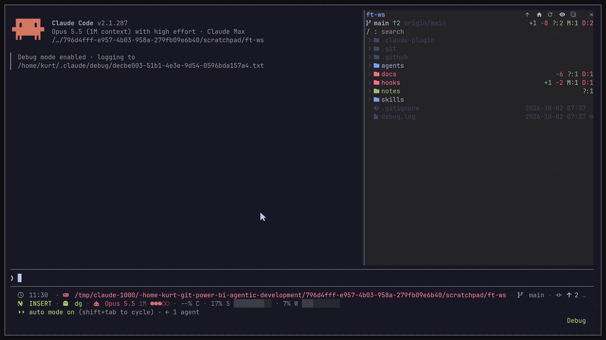

<h1 align="center">filetree</h1>

<p align="center">
  An IDE-style file tree for Claude Code that shows what Claude is doing and where in files
</p>

<p align="center">
  
  
  
  
</p>

<p align="center">
  
</p>

> [!NOTE]
> filetree is a Claude Code **mod**: a plugin of function hooks with its own pane. Mods need **Claude Code 2.1.287 or newer**, and the pane docks beside the transcript in fullscreen mode.

---

## Installation

The repo is its own plugin marketplace. Run this in the terminal:

```bash
claude plugin marketplace add data-goblin/filetree
claude plugin install filetree@filetree
```

Or inside a Claude Code session:

```text
/plugin marketplace add data-goblin/filetree
/plugin install filetree@filetree
```

## Features

- Interactive file tree for the working directory where you're using Claude Code; it follows the cwd, or `/filetree <path>` pins another folder
- Search the file tree, including folders you have not opened yet
- Git status per file and folder in color, with exact lines changed (`+N` `-N`) on modified files and `?:N M:N D:N` file counts on folders
- Branch, upstream and ahead/behind in the header
- Visual indicator of Claude reads and searches (purple), writes (orange) and commits (green); collapsed folders open to show the file
- Git and GitHub operations via `git` and `gh` (commit, push, pull, checkout, merge, PR and more) shown as a status at the bottom of the pane
- Selection-aware: the selected file is passed to Claude as context through a `prompt.submit` hook, and `@path` mentions in a prompt reveal that file in the tree
- Double-click a file to open it in its default app
- Click to select, arrow keys to move through the tree
- Light on large repos: no git calls outside a repo, and every git call is scoped to the cwd
- Nerd Font icons with a plain Unicode fallback

### Resizing the pane

You can resize the pane with the mouse, or by setting custom `pane:grow` or `pane:shrink` keybindings in `keybindings.json`

<p align="center">
  
</p>

## Settings

Both settings are in `/config` under filetree.

- **Claude activity:** what shimmers: `reads and writes` (default), `writes`, `reads` or `none`. Git status, line counts and the git status at the bottom always show.
- **Glyphs:** `auto` (default) uses Nerd Font icons when a Nerd Font is installed and your terminal started after it was installed, plain Unicode in the desktop app, and Nerd Font over SSH. `nerd` or `plain` forces one.

## herdr

Clicking rows needs herdr 0.9.1 or later. herdr 0.9.0 and older accept pixel mouse reporting but still send cell positions, which would put every click in the session in the wrong place, so on those versions the rows ignore the mouse and the rest of the pane and session keep working. Run `herdr update` to get row clicks.

## License

[MIT](LICENSE)

*This project is inspired by my Omarchy app [FileBlade](https://github.com/data-goblin/fileblade)*
